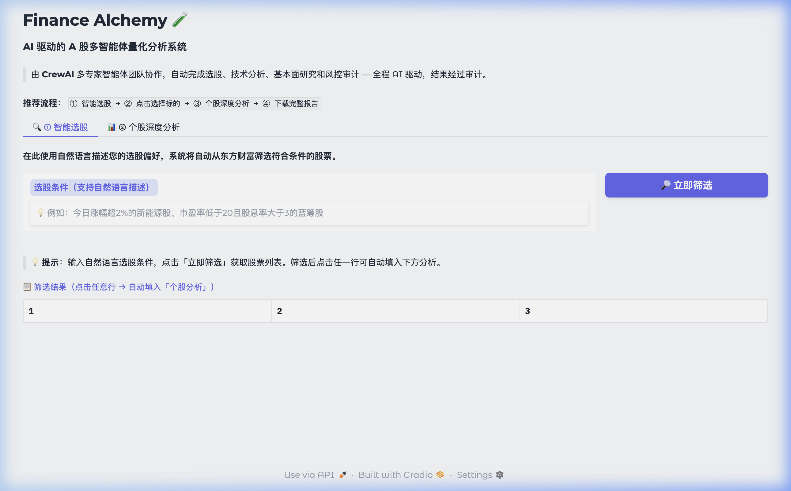
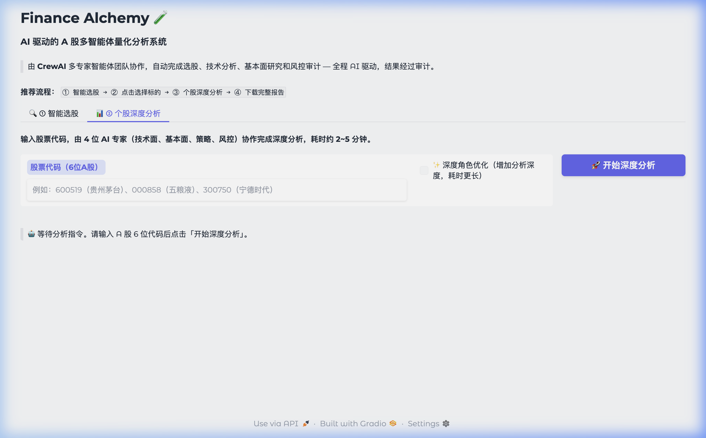

# Finance Alchemy 🧪 - 企业级 A 股智能量化分析系统

[](https://github.com/shawn1207/finance-alchemy)
[](LICENSE)

**Finance Alchemy** 是一个高性能的 A 股量化分析平台。其核心差异点在于将 **CrewAI 多智能体系统 (MAS)** 与 **领域驱动设计 (DDD)** 架构深度结合，解决了 LLM 在处理复杂金融逻辑时容易产生“幻觉”和缺乏结构化约束的问题。

---

## 🌟 核心亮点

### 1. 🤖 多智能体协同分析 (MAS)
系统内置四个角色明确的智能体，通过 CrewAI 进行工作流编排：
- **基本面审计型专家 (Fundamental Agent)**：优先使用东方财富官方 Skill 接口获取权威财报数据与研报摘要。
- **高保真技术面专家 (Technical Agent)**：结合官方深度技术指标与本地量化算法进行指标交叉验证。
- **风险审计专家 (Audit Agent)**：对决策进行“红队测试”，核查逻辑矛盾，抑制 LLM 幻觉。
- **量化交易决策首席 (Strategy Agent)**：汇总多方深度意见，生成带止盈止损参数的投资建议。

### 2. 🏛️ 领域驱动设计 (DDD) 架构
项目采用严格的四层架构，确保业务逻辑与技术实现的解耦：
- **Domain (领域层)**：定义股票实体、财务度量衡及策略聚合根，不依赖任何外部框架。
- **Infrastructure (基础设施层)**：实现 `Eastmoney Skill` 集成、`AkShare` 数据抓取及基于 `Tenacity` 的稳健熔断逻辑。
- **Application (应用层)**：编排智能体协作流与 `Asynchronous Task` 处理。
- **Interface (表现层)**：提供响应式 Gradio 界面与 CLI 工具。

### 3. 🔌 东方财富官方 Skills 集成
深度集成了东方财富官方 **FinSkillsHub** 接口：
- **官方权威数据**: 直接获取东财底层财务指标与实时行情。
- **三级降级机制**: 官方 Skill -> 关键字筛选 API -> AkShare 数据源，确保系统在极端流量下依然稳健。

---

## 🖥️ 系统预览 (System Preview)

### 🔍 智能选股界面
支持自然语言描述选股逻辑，实时响应筛选结果。


### 📊 深度分析界面
多智能体协同工作的核心入口，展示实时分析进度与状态转换。


---

## 🚀 快速上手

### 1. 环境准备
项目基于 `uv` 进行包管理，建议安装 `uv` 以获得极速体验：
```bash
git clone https://github.com/shawn1207/finance-alchemy.git
cd finance-alchemy
uv sync
```

### 2. 配置说明
复制 `.env.example` 并重命名为 `.env`，填入必要的 API 凭据：
```env
OPENAI_API_KEY=your_key
EASTMONEY_API_KEY=your_key
REDIS_URL=redis://localhost:6379/0
```

### 3. 启动服务
系统采用异步架构，需启动两个服务进程：
```bash
# 窗口 1: 启动任务队列
uv run celery -A src.tasks.celery_app worker --loglevel=info

# 窗口 2: 启动可视化界面
uv run python -m src.interface.gui.main
```

---

## 🛠️ 技术栈
- **AI**: CrewAI, LangChain, OpenAI API
- **Backend**: Python 3.11+, Celery, Redis, SQLite
- **Tools**: AkShare (Open Data), Eastmoney Official Skills
- **Architecture**: Domain-Driven Design (DDD)

---

## ⚠️ 免责声明
本系统仅供技术研究与交流使用，生成的分析报告不构成任何投资建议。股市有风险，入市需谨慎。
